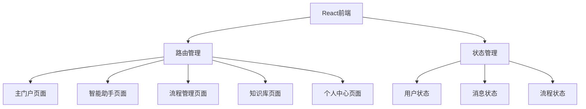

## 1. Architecture Design
本项目采用纯前端架构，使用React构建单页面应用，包含路由管理和状态管理。

## 2. Technology Description
- Frontend: React@18 + TypeScript + Tailwind CSS@3 + Vite
- Initialization Tool: vite-init
- Routing: React Router v6
- State Management: Zustand
- Backend: None（纯前端项目）
- Database: None

## 3. Route Definitions
| Route | Purpose |
|-------|---------|
| / | 主门户页面 - 三栏布局 |
| /assistant | 智能助手页面 - 聊天界面 |
| /process | 流程管理页面 - 审批列表 |
| /knowledge | 知识库页面 - 文档管理 |
| /profile | 个人中心页面 - 用户信息 |

## 4. API Definitions
本项目为纯前端展示项目，不需要后端API。

## 5. Server Architecture Diagram
本项目不涉及后端服务。

## 6. Data Model
本项目不涉及数据库，使用静态模拟数据展示界面。

### 6.1 状态管理模型
- 用户信息：用户基本信息、登录状态
- 消息数据：消息列表、未读状态、消息内容
- 流程数据：流程列表、审批状态、流程详情
- 知识库数据：文档列表、文档内容、创建状态
