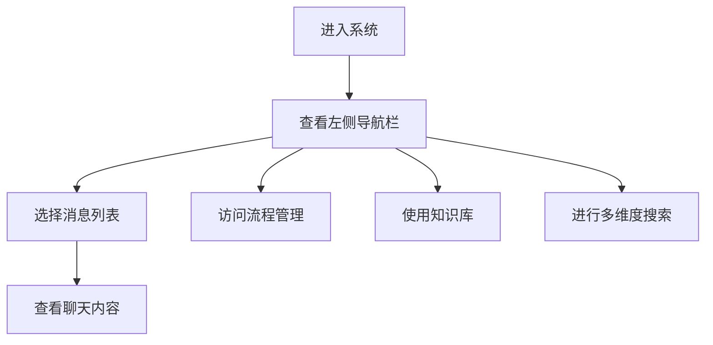

## 1. Product Overview
这是一个企业级智能办公平台的PC端门户系统，位于"new"文件夹中，面向企业内部用户提供消息通讯、流程管理、知识库等功能，打造全新的系统体验。

## 2. Core Features

### 2.1 User Roles
| Role | Registration Method | Core Permissions |
|------|---------------------|------------------|
| 企业用户 | 企业认证 | 使用所有功能模块 |

### 2.2 Feature Module
1. **主门户页面**：左侧导航栏、中间消息列表、右侧内容区域
2. **智能助手**：如意助手聊天界面、问题反馈
3. **流程管理**：项目立项申请、合同签署授权委托书审批
4. **多维度搜索**：流程、文档、业务系统、人员搜索
5. **知识库**：会议纪要创建、在线文档管理
6. **个人中心**：用户信息、安全中心、工作汇报

### 2.3 Page Details
| Page Name | Module Name | Feature description |
|-----------|-------------|---------------------|
| 主门户页面 | 左侧导航栏 | 用户信息、功能模块导航、应用入口 |
| 主门户页面 | 中间消息列表 | 各类消息卡片展示、未读消息标记 |
| 主门户页面 | 右侧内容区域 | 智能助手、流程审批、知识库内容 |
| 智能助手页面 | 聊天界面 | 消息发送、问题反馈、实时查询 |
| 流程管理页面 | 审批列表 | 待审批流程、已审批流程、流程详情 |
| 知识库页面 | 文档管理 | 在线文档选择、空白文档创建、录音转文档 |

## 3. Core Process
用户进入系统后，可以通过左侧导航栏切换不同功能模块，在中间消息列表查看各类通知和消息，点击可在右侧查看详细内容。支持多维度搜索和智能助手交互。

## 4. User Interface Design
### 4.1 Design Style
- 主色调：粉色渐变背景
- 按钮风格：简洁圆角设计
- 字体：现代无衬线字体
- 布局风格：三栏式固定布局
- 卡片风格：白色卡片、轻微阴影、分隔线

### 4.2 Page Design Overview
| Page Name | Module Name | UI Elements |
|-----------|-------------|-------------|
| 主门户页面 | 左侧导航栏 | 粉色渐变背景、用户头像、菜单项、应用分类 |
| 主门户页面 | 中间消息列表 | 白色背景、消息卡片、头像、未读标记、时间戳 |
| 主门户页面 | 右侧内容区域 | 浅灰色背景、智能助手、流程审批卡片、知识库内容 |
| 智能助手页面 | 聊天界面 | 消息输入框、发送按钮、实时查询图标、复制功能 |
| 流程管理页面 | 审批列表 | 流程卡片、审批状态、操作按钮 |
| 知识库页面 | 文档管理 | 下拉选择框、创建按钮、文件上传限制提示 |

### 4.3 Responsiveness
PC端三栏布局，适配不同屏幕尺寸。

### 4.4 3D Scene Guidance
本项目不涉及3D场景。
